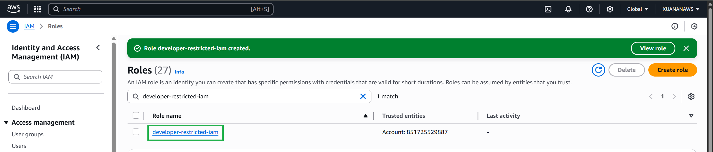

### Create a developer role
Create a role for developers, so that developers have permissions to create roles and policies, with permission boundaries and naming prefixes applied.

1. Sign in to the AWS Management Console as an MFA-enabled IAM user to assume roles in your AWS account and open the [IAM console](https://console.aws.amazon.com/iam/).

2. In the navigation pane, select Roles and then select **Create**.

3. Select **Other AWS Account**, then enter **your account ID** and check **Require MFA**, then select **Next. At this step, select MFA enforcement as a best practice.


4. In the search field, start typing ```creatorole``` and then check the box next to the ``creatorole-restrict-region-boundary`` policy.


5. Clear the **creatorole** filter and start typing ```iam-res```, then check the box next to the ``iam-restricted-list-read`` policy, and select **Next**.


6. Enter ```developer-restricted-iam``` for the Role Name and select **Create Role**.


7. Test the role you created by selecting **developer-restricted-iam** from the list.


8. Make a note of both the **Role ARN** and the **Link to Dashboard**.


9. The role is now created and ready to test!

### Confirm the test developer role
You will now use the MFA-enabled IAM user to assume the new restricted developer iam role.

1. Log in to the [AWS Management Console](https://console.aws.amazon.com ) as the MFA-enabled IAM user.

2. In the console, click your username in the navigation bar in the upper right corner. It usually looks like this: username@account_ID_number_or_aliasthen select Switch roles. Alternatively, you can paste the link you wrote down earlier into your browser.

3. On the Switch Roles page, enter the account ID or account alias and the name of the developer-restricted-iam role you created in the previous step. (Optional) Enter the text you want to display in the navigation bar in place of your username when this role is active. A name is suggested, based on your account and role information, but you can change it to whatever makes sense to you. You can also choose a color to highlight the display name.

4. Select Switch Roles . If this is the first time you have selected this option, a page will appear with more information. After reading, select Switch Roles . If you clear your browser cookies, this page may appear again.
