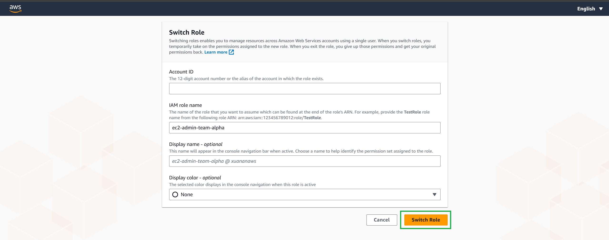

### Đảm nhiệm vai trò ec2-admin-team-alpha
Bây giờ bạn sẽ sử dụng người dùng IAM hiện có đã bật MFA để đảm nhận vai trò ec2-admin-team-alpha mới .

1. Đăng nhập vào AWS Management Console với tư cách là người dùng IAM có bật MFA. https://console.aws.amazon.com .

2. Trong bảng điều khiển, hãy chọn tên người dùng của bạn trên thanh điều hướng ở góc trên bên phải. Nó thường trông như thế này: username@account_ID_number_or_aliassau đó chọn Chuyển đổi vai trò . Ngoài ra, bạn có thể dán liên kết vào trình duyệt mà bạn đã ghi lại trước đó.

3. Trên trang Chuyển đổi vai trò, nhập số ID tài khoản của bạn vào trường Tài khoản và tên của vai trò ec2-admin-team-alpha mà bạn đã tạo ở bước trước đó vào trường Vai trò . (Tùy chọn) Nhập văn bản mà bạn muốn hiển thị trên thanh điều hướng thay cho tên người dùng của bạn khi vai trò này đang hoạt động. Một tên được đề xuất, dựa trên thông tin tài khoản và vai trò, nhưng bạn có thể thay đổi thành bất kỳ tên nào có ý nghĩa với bạn. Bạn cũng có thể chọn màu để làm nổi bật tên hiển thị.

4. Chọn Chuyển đổi vai trò . Nếu đây là lần đầu tiên chọn tùy chọn này, một trang sẽ xuất hiện với nhiều thông tin hơn. Sau khi đọc, hãy chọn Chuyển đổi vai trò. Nếu bạn xóa cookie của trình duyệt, trang này có thể xuất hiện lại.

5. Tên hiển thị và màu sắc sẽ thay thế tên người dùng của bạn trên thanh điều hướng và bạn có thể bắt đầu sử dụng các quyền mà vai trò đó cấp cho bạn thay thế cho quyền mà bạn có với tư cách là người dùng IAM.

{}
Một số vai trò cuối cùng mà bạn đã sử dụng sẽ xuất hiện trên menu. Lần sau khi bạn cần chuyển sang một trong những vai trò đó, bạn chỉ cần chọn vai trò bạn muốn. Bạn chỉ cần nhập thông tin tài khoản và vai trò theo cách thủ công nếu vai trò không được hiển thị trên menu Identity.
{}